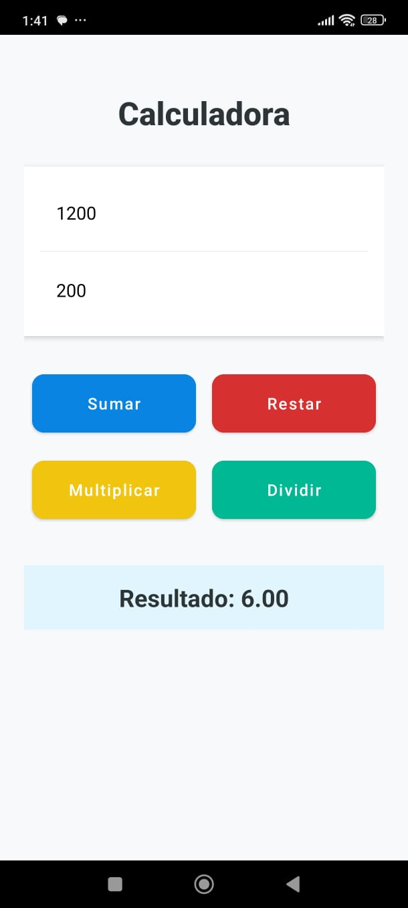

# Calculadora - Actividad 5

Este proyecto es una aplicación de calculadora básica desarrollada para el curso de **Desarrollo Móvil 1**. La aplicación permite realizar las cuatro operaciones aritméticas fundamentales con una interfaz moderna y validaciones de seguridad.

## ✨ Características

- **Operaciones Básicas:** Suma, Resta, Multiplicación y División.
- **Interfaz Moderna:** Diseño basado en Material Components con bordes redondeados y una paleta de colores limpia.
- **Validaciones:**
  - Control de campos vacíos (notificación vía Toast).
  - Manejo de error de división por cero.
- **Resultados:** Visualización de resultados con formato de hasta 2 decimales.

## 🛠️ Tecnologías Utilizadas

- **Lenguaje:** Kotlin
- **Diseño de Interfaz:** XML Layouts con Material Components.
- **Arquitectura:** AppCompatActivity.
- **Versión de SDK:** 34
- **Herramienta de Construcción:** Gradle (Kotlin DSL).

## 📸 Captura de Pantalla

## 🚀 Instrucciones de Ejecución

1. Clonar el repositorio.
2. Abrir el proyecto en **Android Studio (versión Jellyfish o superior)**.
3. Sincronizar los archivos de Gradle.
4. Ejecutar la aplicación en un Emulador o dispositivo físico con Android 7.0 (API 24) o superior.

---
**Desarrollado por:** Dumar Pabón
**Curso:** Desarrollo Móvil 1 - Actividad 5
